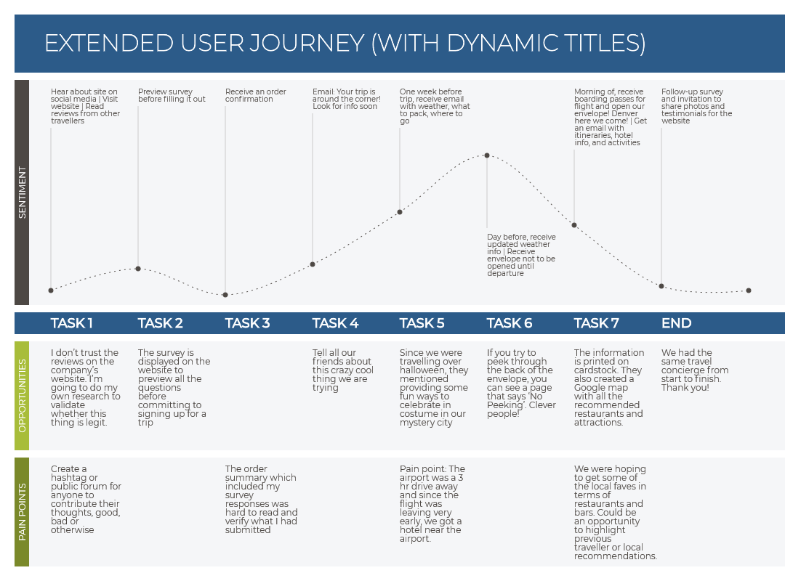

# Open source user journey map creator

Web app to dynamically create SVG and PNG images of user journey from a CSV file.
With this app, the user journey can be described in text from a CSV file and then rendered as an image to show the different journey stages.

## Usage

1. Prepare a CSV file (or export a CSV from a spreadsheet) with a separate column for each step of the journey as detailed in the data section below.
2. Select and load your CSV file.
3. Download the PNG, or use the SVG in Sketch, XD, etc to customise the appearance to suit your own style.

## Data

The CSV should be arranged in the following way (see [sample CSV](assets/data/transposed.csv) for details):
The layout of the CSV mirrors the layout of the diagram. Each row represents a row in the chart. The first column is used as the row title, the second is the colour of the row title bar.
There are three custom titles:

* the first cell (V1.1) is used for the chart title.
* SCORE is used to draw the customer experience curve
* the line following is used for the notes within the row
* TITLE_BLOCK is used to display a row with simple titles (see example below)

The roider of the rows can be altered or added to as required. 

The section titles can be renamed as required, eg to display a timescale instead of pain points.

## Example screenshot

## Bug report

Please send the report to Issues on Github.

## License

The MIT License (MIT). See LICENSE.
